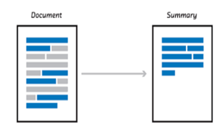

# Text Summarization using NMF (Non-Negative Matrix Factorization)

Welcome to the "Text Summarization using NMF" project repository! This project aims to explore the field of text summarization by leveraging the power of Non-Negative Matrix Factorization (NMF) to condense extensive text documents into concise and coherent summaries.

## Overview

Text summarization plays a pivotal role in Natural Language Processing (NLP), enabling the extraction of key insights and information from voluminous text data. This project delves into the application of Non-Negative Matrix Factorization to generate meaningful and effective summaries from input text sources.

## How NMF Works

Non-Negative Matrix Factorization is a mathematical technique that decomposes a given matrix into two non-negative matrices. In the context of text summarization, NMF can be employed to identify latent topics present within a collection of documents, ultimately facilitating the extraction of pivotal sentences that encapsulate those topics.

## Project Features

- **Preprocessing Pipeline:** An inclusive text preprocessing pipeline has been developed, incorporating fundamental tasks such as tokenization and stop word removal.
- **NMF Implementation:** The project employs the scikit-learn library to implement the Non-Negative Matrix Factorization algorithm.
- **Summary Generation:** The project showcases the generation of coherent and informative summaries, using the latent topics derived from the NMF process.
- **Interactive Interface (Optional):** Additionally, there is an option to include an interactive user interface for seamless input and summarized output.

## Getting Started

1. Clone this repository: `git clone https://github.com/your_username/your_project.git`
2. Navigate to the project directory: `cd your_project`
3. Install the required dependencies: `pip install -r requirements.txt`
4. Run the project: `python main.py`

## Usage

1. Provide the text document you wish to summarize.
2. Execute the NMF-based summarization algorithm.
3. Receive a condensed summary of the input document.

## Contributing

Contributions to this project are welcomed and appreciated. If you wish to introduce new features, resolve bugs, or enhance the documentation, please consult the [Contributing Guidelines](CONTRIBUTING.md).

## Contact

For inquiries or discussions, feel free to get in touch with the project maintainers:

- [Your Name](Link to Your GitHub Profile)
- [Co-Maintainer's Name](Link to Co-Maintainer's GitHub Profile)

## License

This project is licensed under the [MIT License](LICENSE).

---

Thank you for your interest in the "Text Summarization using NMF" project. We hope this tool aids your text summarization endeavors. Happy exploring! 🚀📚
